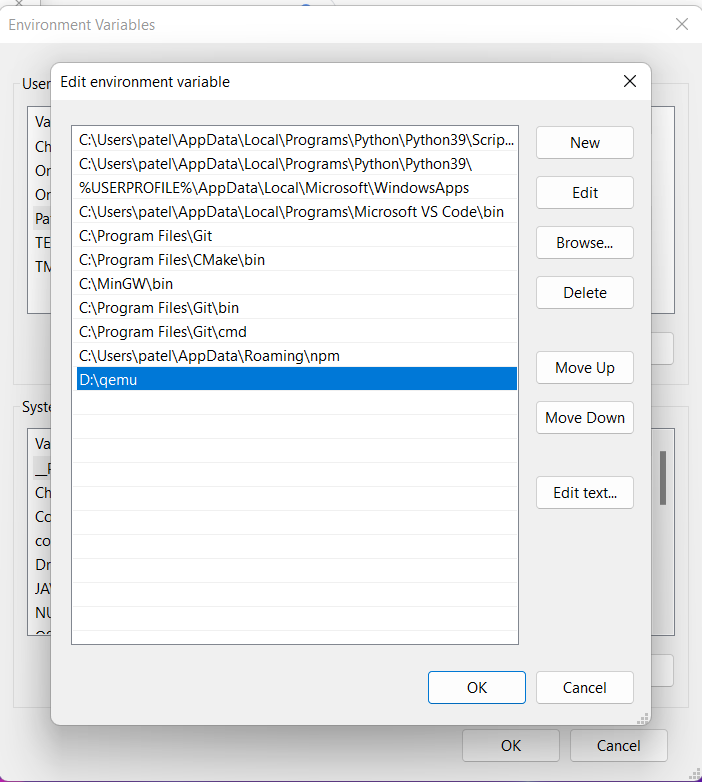

# QEMU Installation Steps
---
#### Downloaded ubuntu server image from the following link:
- https://releases.ubuntu.com/22.04/
#### Download and Install QEMU for Windows(x64) from the following link:
 - https://www.qemu.org/download/#windows
#### Add QEMU path into Environment Variables as shown in the image below

### Open the command Prompt/Powershell and execute the following commands:
#### Go to the directory where QEMU is installed(In this case: D:)
```sh
$ D:
```
#### Create QEMU image of ubuntu in qcow2 file format using following command
```sh
$ qemu-img create -f qcow2 ubuntu.img 10G
```
#### Boot iso file on QEMU with the following command
```sh
$ qemu-system-x86_64 -hda ubuntu.img -boot d -cdrom <"your\path\to\iso file\ubuntu-22.04.1-desktop-amd64.iso"> -m 2048
```
#### Complete the normal Ubuntu installation steps and then follow the below directions:

#### Now, to install sysbench on QEMU follow the below commands
```sh
$ sudo apt-get update
$ sudo apt install sysbench
```
#### Check sysbench version installed
```sh
$ sysbench --version
```
